# Visual-Odometry_with_Image-Preprocessing
ORB Feature기반 Visual Odometry 에서 이미지 전처리 과정을 통해 얻은 Odometry와 Original Odometry 비교

# Image Filter
* HPF  
* HPF-임계값 적용
* LPF-AVG
* LPF-Gaussian Filter
* LPF-Median Filter
* LPF-Bilateral Filter

# Test  
**Green : Truth**

## Test1
Feature : 1500  
* Original

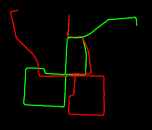

* HPF(Left) / HPF-임계값 적용(Right)  

|HPF|HPF-임계값적용|
|:--:|:--:|
|
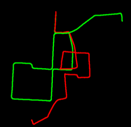
 | 
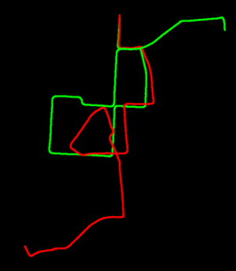
|  

* LPF-AVG(Left) / LPF-Gaussian Filter(Right)

|LPF-Average|LPF-Gaussian filter|
|:--:|:--:|
|
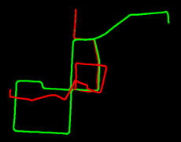
 | 
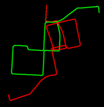
|  
  
* LPF-Median Filter(Left) / LPF-Bilateral Filter(Right)

|LPF-Median Filter|LPF-Bilateral Filter|
|:--:|:--:|
|
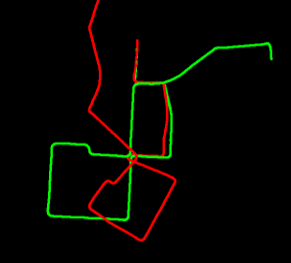
 | 
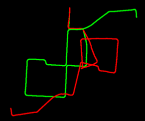
|  

## Test2
Feature : 4000  
* Original

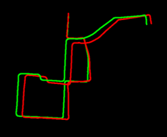

* HPF(Left) / HPF-임계값 적용(Right)  

|HPF|HPF-임계값적용|
|:--:|:--:|
|
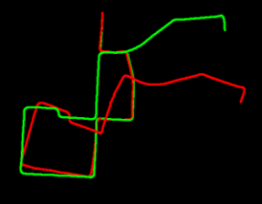
 | 
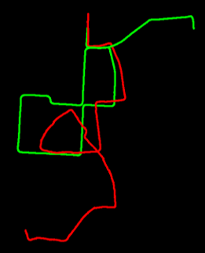
|  

* LPF-AVG(Left) / LPF-Gaussian Filter(Right)

|LPF-Average|LPF-Gaussian filter|
|:--:|:--:|
|
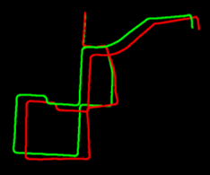
 | 
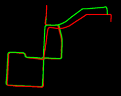
|  
  
* LPF-Median Filter(Left) / LPF-Bilateral Filter(Right)

|LPF-Median Filter|LPF-Bilateral Filter|
|:--:|:--:|
|
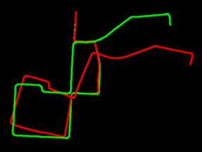
 | 
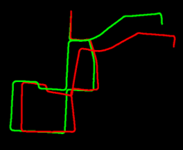
|  

# Result
## Test1

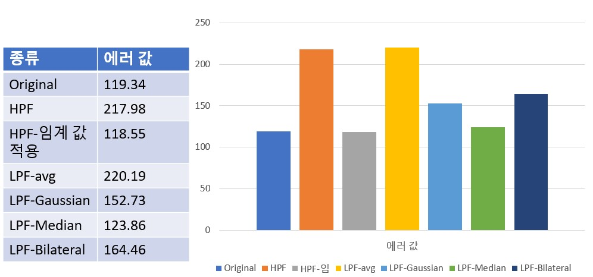

## Test2

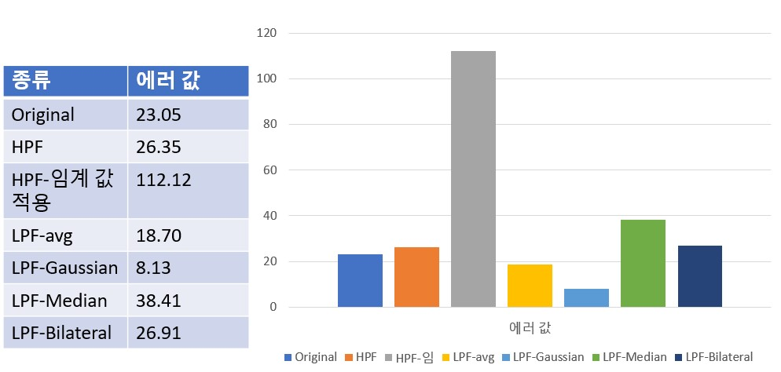

# Conclusion
* Feature 갯수가 적을 때는 이미지 전처리를 하지 않고 Odometry를 추정하는 것이 더 성능이 좋았다.
* Feature 갯수가 많을 때는 Gaussian 필터를 적용해 전처리를 한 후 Odometry를 추정하는 것이 더 성능이 좋았다.